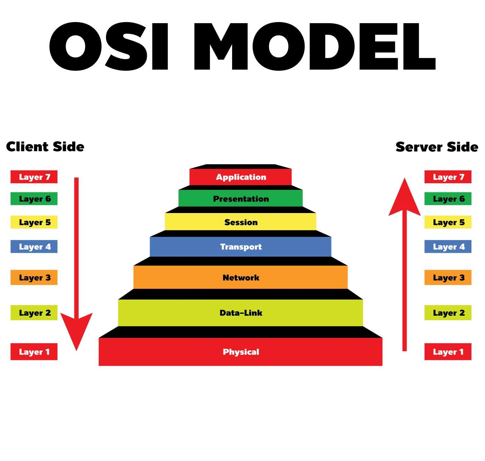

# OSI (Open Systems Interconnection) 📶
Model Referensi OSI (Open Systems Interconnection) adalah kerangka kerja konseptual yang digunakan untuk memahami dan menggambarkan bagaimana komunikasi jaringan komputer berfungsi. Model ini dikembangkan oleh International Organization for Standardization (ISO) sebagai cara untuk mengatur dan mengklasifikasikan fungsi-fungsi yang terlibat dalam komunikasi jaringan.

 

        

Model OSI terdiri dari 7 lapisan yang masing-masing memiliki fungsi khusus dalam proses komunikasi. Ini membantu memecah proses kompleks komunikasi menjadi komponen yang lebih sederhana dan teratur. Lapisan-lapisan ini bekerja bersama untuk mengatur dan mengelola pengiriman data antara perangkat pada jaringan yang berbeda.

---
## Penjelasan tentang setiap lapisan OSI beserta fungsinya 📖
### 1.  Lapisan Fisik (_Physical Layer_)
Lapisan fisik bertanggung jawab atas kabel fisik atau koneksi nirkabel di antara simpul jaringan. Lapisan ini mendefinisikan konektor, kabel listrik atau teknologi nirkabel yang menghubungkan perangkat, dan bertanggung jawab atas transmisi data mentah, yang hanya berupa rangkaian 0 dan 1, sambil menangani kontrol kecepatan bit.

Fungsi utamanya adalah mengatur transmisi bit melalui media fisik seperti kabel atau gelombang radio. Ini melibatkan aspek seperti tegangan, frekuensi, dan jenis kabel yang digunakan. Lapisan ini berurusan dengan detail teknis terendah dalam komunikasi.

### 2. Lapisan Data Link (_Data Link Layer_)
Lapisan data-link membuat dan memutuskan koneksi antara dua node yang terhubung secara fisik pada jaringan. Lapisan ini memecah paket menjadi frame dan mengirimkannya dari sumber ke tujuan. Lapisan ini terdiri dari dua bagian-Logical Link Control (LLC), yang mengidentifikasi protokol jaringan, melakukan pengecekan kesalahan dan menyinkronkan frame, dan Media Access Control (MAC) yang menggunakan alamat MAC untuk menyambungkan perangkat dan menentukan izin untuk mengirim dan menerima data.

### 3. Lapisan Jaringan (_Network Layer_)
Lapisan jaringan memiliki dua fungsi utama. Salah satunya adalah memecah segmen menjadi paket jaringan, dan menyusun kembali paket-paket tersebut di sisi penerima. Fungsi lainnya adalah merutekan paket dengan menemukan jalur terbaik melintasi jaringan fisik. Lapisan jaringan menggunakan alamat jaringan (biasanya alamat Protokol Internet) untuk merutekan paket ke simpul tujuan.

### 4. Lapisan Transport (_Transport Layer_)
Lapisan transport mengambil data yang ditransfer dalam lapisan sesi dan memecahnya menjadi "segmen" pada ujung transmisi. Lapisan ini bertanggung jawab untuk menyusun kembali segmen-segmen tersebut di ujung penerima, mengubahnya kembali menjadi data yang dapat digunakan oleh lapisan sesi. Lapisan transport melakukan kontrol aliran, mengirim data pada kecepatan yang sesuai dengan kecepatan koneksi perangkat penerima, dan kontrol kesalahan, memeriksa apakah data diterima dengan tidak benar dan jika tidak, memintanya lagi.
    
### 5.Lapisan Sesi (_Session Layer_)
Lapisan sesi membuat saluran komunikasi, yang disebut sesi, antar perangkat. Lapisan ini bertanggung jawab untuk membuka sesi, memastikan sesi tetap terbuka dan berfungsi saat data ditransfer, dan menutupnya saat komunikasi berakhir. Lapisan sesi juga dapat mengatur titik pemeriksaan selama transfer data-jika sesi terputus, perangkat dapat melanjutkan transfer data dari titik pemeriksaan terakhir.
### 6.Lapisan Presentasi (_Presentation Layer_)
 Lapisan presentasi menyiapkan data untuk lapisan aplikasi. Lapisan ini mendefinisikan bagaimana dua perangkat harus menyandikan, mengenkripsi, dan mengompresi data sehingga data dapat diterima dengan benar di ujung yang lain. Lapisan presentasi mengambil data apa pun yang ditransmisikan oleh lapisan aplikasi dan mempersiapkannya untuk transmisi melalui lapisan sesi.
### 7.Lapisan Aplikasi (_Application Layer_)
Lapisan aplikasi digunakan oleh perangkat lunak pengguna akhir seperti browser web dan klien email. Lapisan ini menyediakan protokol yang memungkinkan perangkat lunak untuk mengirim dan menerima informasi serta menyajikan data yang berarti bagi pengguna. Beberapa contoh protokol lapisan aplikasi adalah Hypertext Transfer Protocol (HTTP), File Transfer Protocol (FTP), Post Office Protocol (POP), Simple Mail Transfer Protocol (SMTP), dan Domain Name System (DNS).

---

_sumber bacaan : [https://www.imperva.com/learn/application-security/osi-model/](https://www.imperva.com/learn/application-security/osi-model/)_
