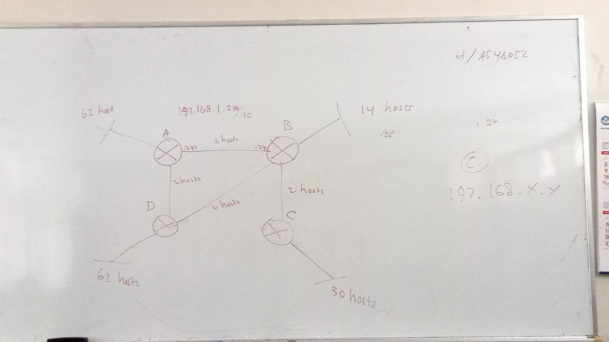
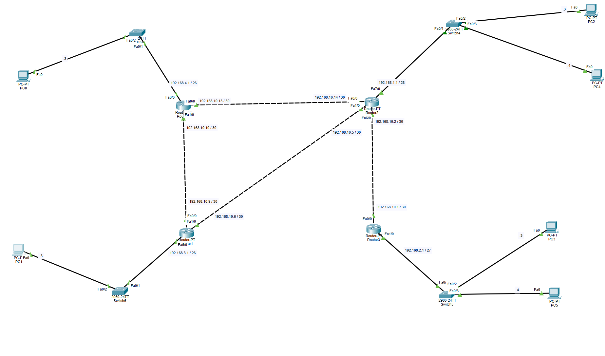
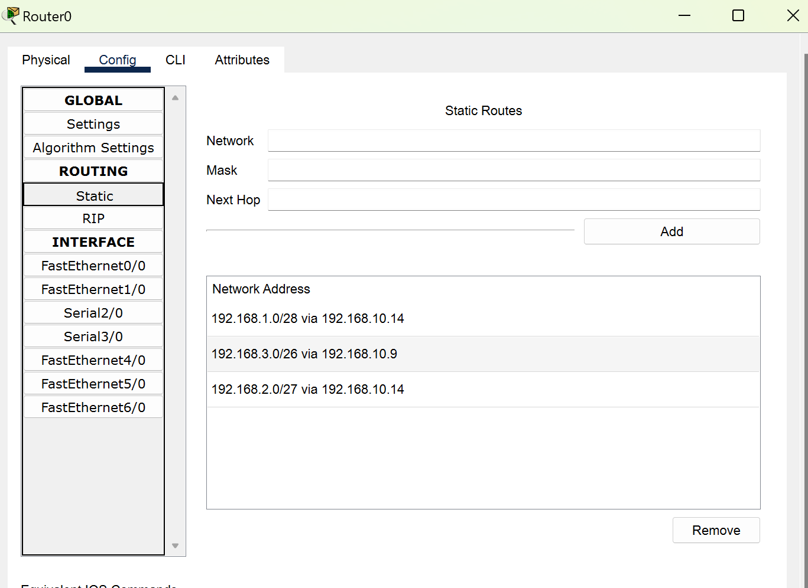
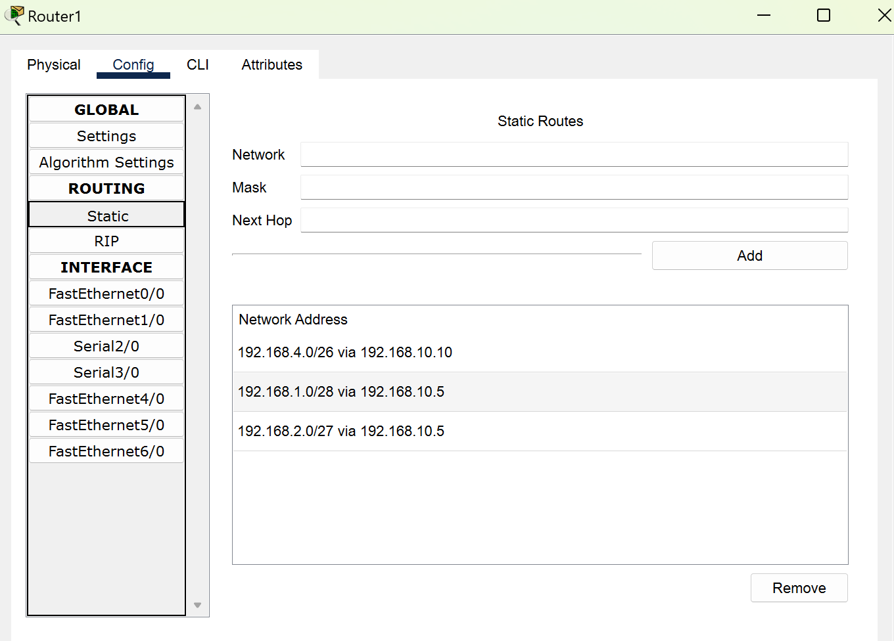
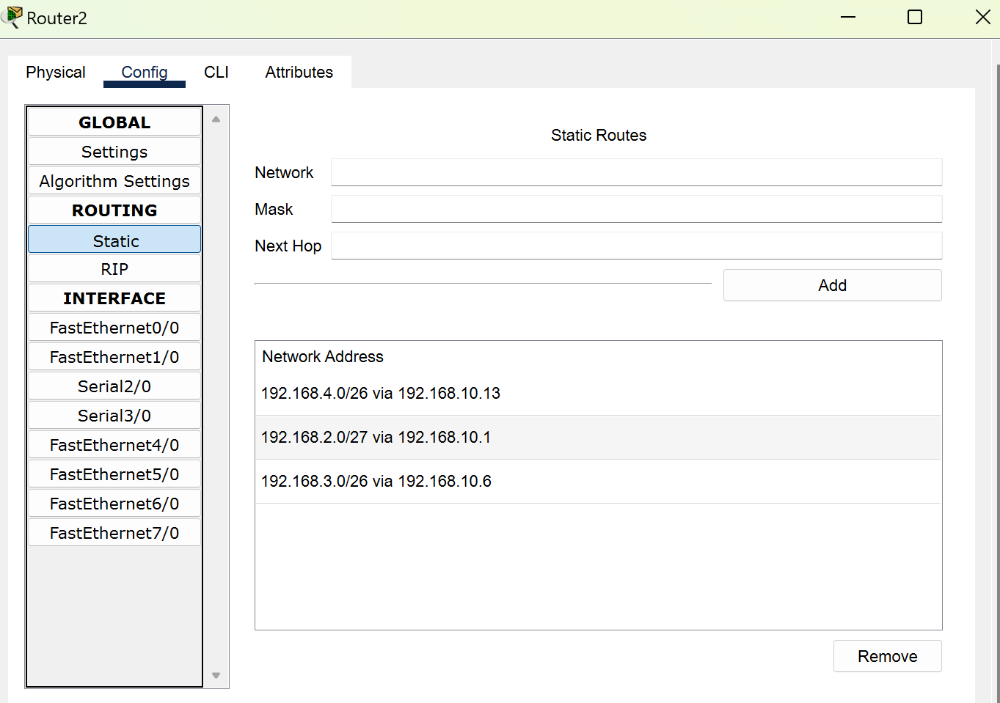
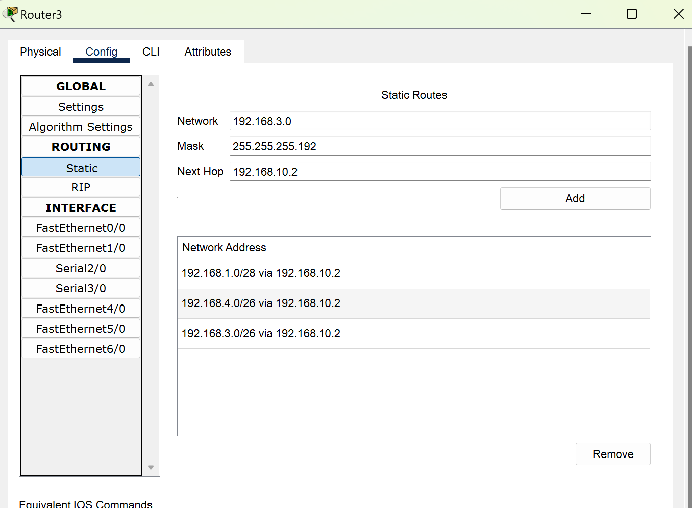
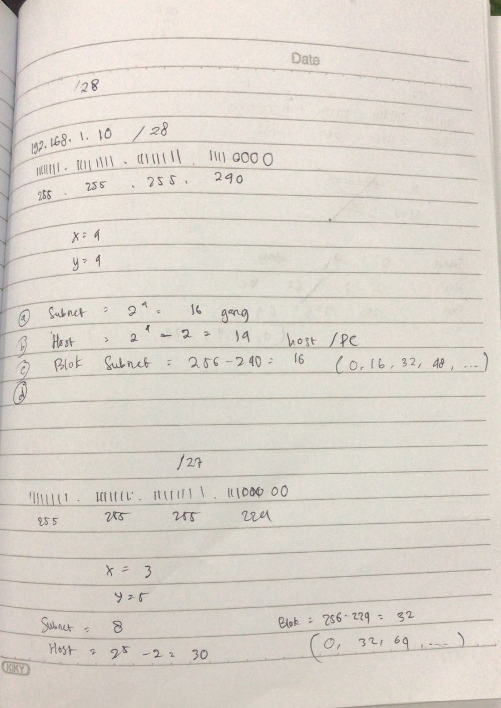
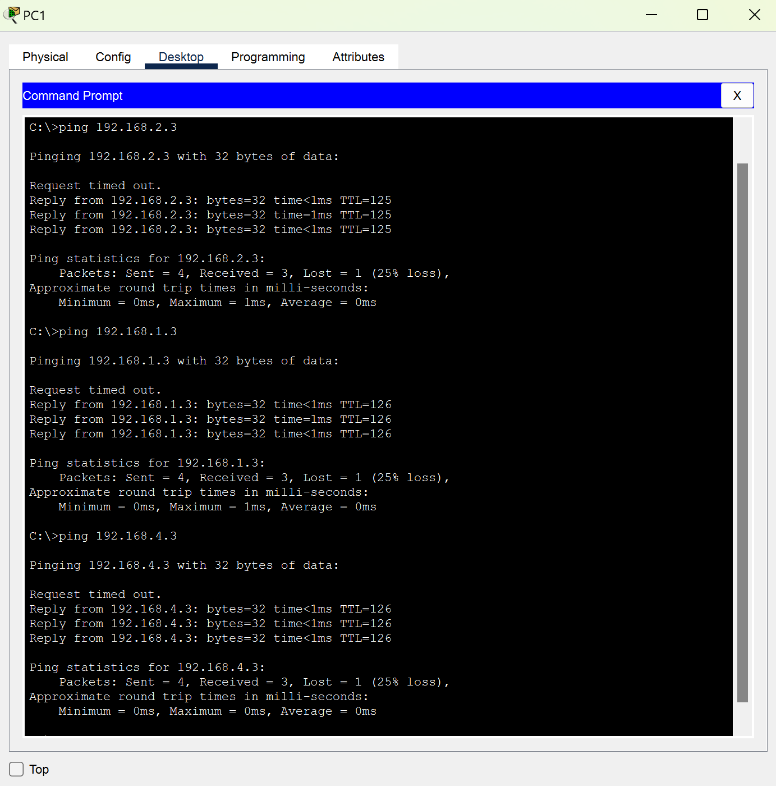

# Subnetting Router
## Tentang Projek

Repository untuk menyimpan semua tugas pada mata kuliah Konsep Jaringan yang diampu oleh Dr. Ferry Astika Saputra ST, M.Sc ([@ferryastika](https://github.com/ferryastika)).

---

## Task
membuat 4 Router seperti di bawah dengan subnetting sesuai yang ditentukan dengan host yang digunakan, dan semua menggunakan kelas C

---

## Result

---

#### Router 0 Static

#### Router 1 Static

#### Router 2 Static

#### Router 3 Static

---

### Perhitungan Antar Router

### Perhitungan Jika 14 PC (diatas) & 30 PC (dibawah)

### Perhitungan Jika 62 PC 

## Contoh Melakukan Ping
