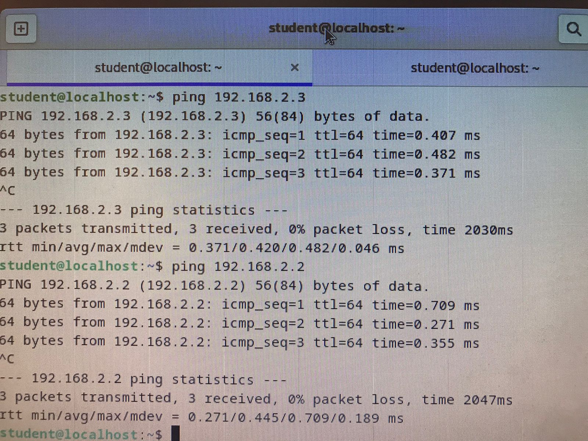
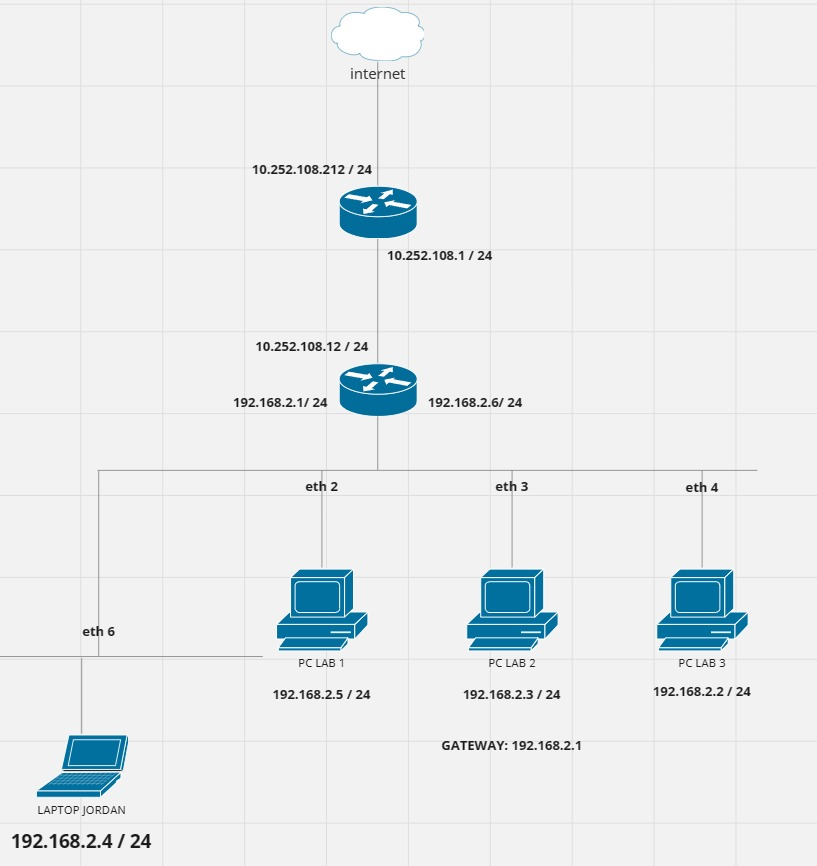

# Routing Table
berikut jawaban dari penugasan Routing table : 
## Tentang Projek

Repository untuk menyimpan semua tugas pada mata kuliah Konsep Jaringan yang diampu oleh Dr. Ferry Astika Saputra ST, M.Sc ([@ferryastika](https://github.com/ferryastika)).

---
## Ping
Ping adalah perintah yang digunakan untuk mengukur waktu respons atau latency dari satu perangkat atau komputer ke perangkat atau komputer lain dalam jaringan.
### 1. Ping Antar PC 
Ketika Anda melakukan ping antar dua PC yang terhubung ke router yang sama, ping akan mengukur waktu yang diperlukan untuk paket data pergi dari satu PC melalui router dan tiba di PC lainnya. Ini memberi Anda gambaran tentang seberapa cepat komunikasi antara dua perangkat dalam jaringan lokal Anda. Hasilnya akan mencakup round-trip time (RTT), yang mencerminkan latency atau keterlambatan komunikasi.

### 2. Ping kepada Router
Ketika Anda melakukan ping antara dua PC yang terhubung ke router yang berbeda, ping masih mengukur waktu respons atau latency. Namun, dalam hal ini, paket data harus pergi dari satu PC ke router pertama, kemudian menuju ke router kedua, dan akhirnya mencapai PC tujuan. Ini akan menghasilkan RTT yang lebih tinggi dibandingkan dengan ping antar PC yang terhubung ke router yang sama. Waktu yang dibutuhkan untuk paket melewati dua router tambahan akan menambah latency secara signifikan.

### 3. Ping ke PC di luar Router
Ketika Anda melakukan ping ke router itu sendiri, Anda mengukur latency atau waktu respons antara PC Anda dan router yang digunakan sebagai gateway jaringan. Hasil ping ini akan memberikan informasi tentang seberapa baik router tersebut berfungsi dalam mengelola lalu lintas jaringan. Latency yang rendah pada ping ke router adalah indikasi kualitas jaringan yang baik.

---
## Physical Route
Physical Route merujuk pada jalur atau media transmisi fisik sebenarnya yang digunakan untuk mengirimkan data dari satu perangkat jaringan ke perangkat lainnya. Ini bisa termasuk kabel fisik, switch, router, dan perangkat keras jaringan lainnya.

Physical Route melibatkan komponen nyata dalam infrastruktur jaringan. Sebagai contoh, ini mencakup kabel Ethernet, serat optik, gelombang radio nirkabel, dan perangkat keras jaringan seperti switch dan router. Konsep ini berhubungan dengan bagaimana paket data fisiknya bergerak melalui kabel dan perangkat keras jaringan.

## Logical Route
logical route merujuk pada jalur yang ditentukan secara logis atau abstrak yang diikuti oleh paket data dari sumber ke tujuan dalam jaringan. Rute ini didefinisikan melalui protokol routing dan alamat logis.

logical route tidak selalu mencerminkan physical route yang diambil oleh data, tetapi merupakan representasi logis atau abstrak mengenai cara data harus bergerak melalui jaringan. logical route ditentukan berdasarkan faktor seperti alamat IP, tabel routing, dan konfigurasi jaringan. Rute ini digunakan untuk memastikan data mencapai tujuannya dengan efisien, bahkan jika physical routenya berubah akibat perubahan atau kegagalan jaringan.

## IP Route Print

Perintah "ip route print" adalah perintah yang digunakan untuk menampilkan daftar tabel routing pada sebuah router atau perangkat jaringan yang menjalankan sistem operasi yang mendukung perintah tersebut. Tabel routing adalah daftar aturan yang digunakan oleh router untuk menentukan cara sebaiknya mengarahkan paket data yang diterimanya ke tujuan yang benar dalam jaringan. Berikut adalah penjelasan lebih lanjut mengenai "ip route print" pada sebuah router:

### 1. Daftar Rute (Routes List):

Perintah "ip route print" akan menampilkan daftar semua entri routing yang ada pada router. Setiap entri routing akan mencakup informasi seperti alamat tujuan, subnet mask, gateway, dan interface yang digunakan.

### 2. Alamat Tujuan (Destination Address):

Setiap baris dalam keluaran perintah "ip route print" akan menampilkan alamat tujuan atau subnet yang sesuai dengan entri routing. Ini adalah alamat atau jaringan yang diarahkan oleh router.

### 3. Subnet Mask:

Subnet mask menentukan bagian mana dari alamat yang harus digunakan sebagai alamat jaringan dan bagian mana yang digunakan sebagai alamat host. Ini membantu router dalam menentukan subnet mana yang sesuai dengan alamat tujuan.

### 4. Gateway:

Gateway adalah alamat IP yang ditentukan dalam tabel routing sebagai langkah selanjutnya dalam mengirimkan paket ke alamat tujuan. Jika alamat tujuan terletak di jaringan lokal yang terhubung langsung ke router, maka gateway bisa berupa alamat IP router itu sendiri.

### 5. Interface:

Interface adalah antarmuka fisik atau logis di mana router akan mengirimkan paket data ke alamat tujuan. Ini menentukan jalur fisik yang akan digunakan oleh paket.

### 6. Metric:

Metric adalah nilai numerik yang mengindikasikan prioritas atau "biaya" rute yang digunakan. Nilai metric digunakan oleh router untuk memutuskan rute terbaik ketika ada beberapa rute yang tersedia ke alamat tujuan yang sama.

### 7.Tipe Rute (Route Type):

Tabel routing pada router dapat berisi berbagai tipe rute, termasuk rute default (default route), rute statis (static route), rute dinamis (dynamic route), dan lainnya. Setiap tipe rute memiliki karakteristik dan metode penentuan yang berbeda.

Perintah "ip route print" sangat berguna untuk pemantauan dan pemecahan masalah jaringan. Dengan melihat tabel routing, administrator jaringan dapat memahami cara router mengarahkan paket data ke tujuan yang benar. Hal ini juga memungkinkan untuk memverifikasi pengaturan routing yang tepat dan memastikan kinerja jaringan yang baik.

