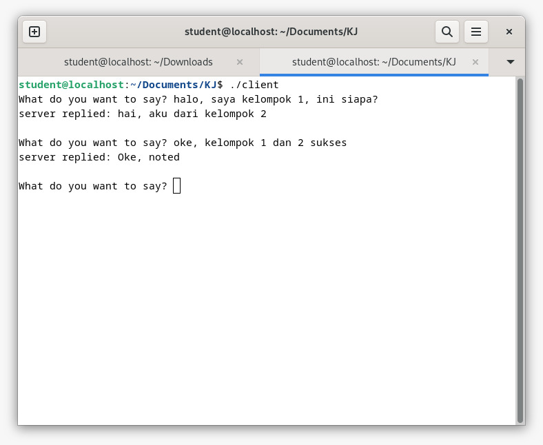

# Chat Menggunakan Socket Programming Melalui jaringan Mikrotik
## Tentang Projek

Repository untuk menyimpan semua tugas pada mata kuliah Konsep Jaringan yang diampu oleh Dr. Ferry Astika Saputra ST, M.Sc ([@ferryastika](https://github.com/ferryastika)).

---

