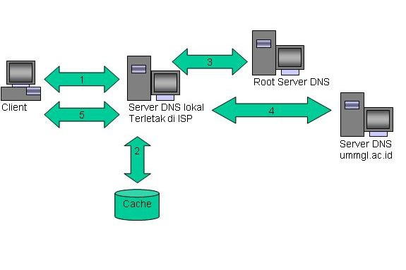
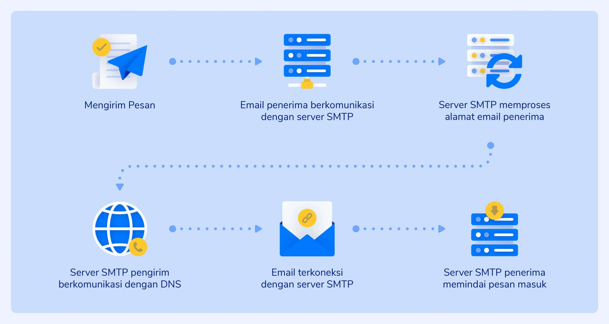

# DNS (Domain Name System) & Email Server

## Tentang Projek

Repository untuk menyimpan semua tugas pada mata kuliah Konsep Jaringan yang diampu oleh Dr. Ferry Astika Saputra ST, M.Sc ([@ferryastika](https://github.com/ferryastika)).

---

# DNS (Domain Name System)

    

DNS adalah singkatan dari Domain Name System. DNS adalah sistem yang menerjemahkan nama domain menjadi alamat IP. Nama domain adalah alamat web yang mudah diingat, seperti "google.com" atau "detik.com". Alamat IP adalah alamat numerik yang digunakan komputer untuk berkomunikasi satu sama lain.

### Cara kerja DNS adalah sebagai berikut:

Saat pengguna memasukkan nama domain di browser, browser akan meminta DNS server untuk menerjemahkan nama domain tersebut.
DNS server akan mencari alamat IP yang sesuai dengan nama domain tersebut.
Jika alamat IP ditemukan, DNS server akan mengembalikan alamat IP tersebut ke browser.
Browser kemudian akan menggunakan alamat IP tersebut untuk mengakses situs web yang dituju.

# Email Server

    

Email server adalah server yang digunakan untuk mengirim dan menerima email. Email server menyimpan email pengguna di dalam databasenya.

### Cara kerja email server adalah sebagai berikut:

Saat pengguna mengirim email, email tersebut akan dikirim ke email server penerima.
Email server penerima akan menyimpan email tersebut di dalam databasenya.
Ketika penerima membuka email, email tersebut akan diambil dari database email server penerima.
Fungsi DNS

### Fungsi DNS adalah sebagai berikut:

Menerjemahkan nama domain menjadi alamat IP.
Membantu pengguna untuk mengakses situs web dengan mudah.
Menjaga keamanan situs web.
Fungsi Email Server

### Fungsi email server adalah sebagai berikut:

Menyimpan email pengguna.
Mengirim email dari satu pengguna ke pengguna lainnya.
Menerima email dari satu pengguna ke pengguna lainnya.
Penjelasan DNS dan Email Server

DNS dan email server adalah dua komponen penting dalam internet. DNS membantu pengguna untuk mengakses situs web dengan mudah, sedangkan email server membantu pengguna untuk mengirim dan menerima email.

DNS dan email server bekerja sama untuk memastikan bahwa pengguna dapat mengakses situs web dan mengirim serta menerima email dengan lancar.

# Berikut adalah beberapa contoh penerapan DNS dan email server:

Saat Anda membuka situs web di browser, DNS server akan menerjemahkan nama domain situs web tersebut menjadi alamat IP. Alamat IP tersebut kemudian akan digunakan oleh browser untuk mengakses situs web tersebut.
Saat Anda mengirim email, email server akan menyimpan email tersebut di dalam databasenya. Ketika penerima membuka email, email tersebut akan diambil dari database email server penerima.
DNS dan email server adalah teknologi yang kompleks, tetapi penting untuk memahami cara kerja mereka. Dengan memahami cara kerja DNS dan email server, Anda dapat menggunakan internet dengan lebih efisien dan aman.