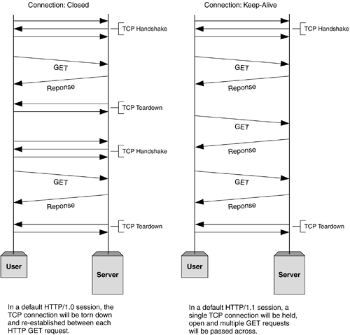

# Evolusi HTTP - HTTP/0.9, HTTP/1.0, HTTP/1.1, Keep-Alive, Upgrade, dan HTTPS

        

## HTTP/0.9 - Protokol Satu Baris
- Versi awal HTTP - protokol client-server, request-response, dan protokol telnet-friendly

- Sifat permintaan: satu baris (metode + jalur untuk dokumen yang diminta)

- Metode yang didukung: Hanya GET

- Jenis respons: hanya hiperteks

- Sifat koneksi: diakhiri segera setelah respons

- Tidak ada header HTTP (tidak dapat mentransfer file jenis konten lain), Tidak ada kode status/kesalahan, Tidak ada URL, Tidak ada versi

        $> telnet ashenlive.com 80(Connection 1 Establishment - TCP Three-Way Handshake)
        Connected to xxx.xxx.xxx.xxx(Request)
        GET /my-page.html(Response in hypertext)
        <HTML>
        A very simple HTML page
        </HTML>(Connection 1 Closed - TCP Teardown)

Server web populer (Apache, Nginx) masih mendukung HTTP/0/9. Coba buka sesi Telnet dan akses google.com

## HTTP/1.0 - Membangun ekstensibilitas
- Protokol yang ramah peramban

- Bidang header yang disediakan termasuk metadata yang kaya tentang permintaan dan respons (nomor versi HTTP, kode status, jenis konten)

- Respons: tidak terbatas pada hypertext (Header tipe konten menyediakan kemampuan untuk mengirimkan berkas selain berkas HTML biasa - misalnya skrip, stylesheet, media)

- Metode yang didukung: GET, HEAD, POST

- Sifat koneksi: diakhiri segera setelah respons

        (Connection 1 Establishment - TCP Three-Way Handshake)
        Connected to xxx.xxx.xxx.xxx(Request)
        GET /my-page.html HTTP/1.0 
        User-Agent: NCSA_Mosaic/2.0 (Windows 3.1)(Response)
        HTTP/1.0 200 OK 
        Content-Type: text/html 
        Content-Length: 137582
        Expires: Thu, 01 Dec 1997 16:00:00 GMT
        Last-Modified: Wed, 1 May 1996 12:45:26 GMT
        Server: Apache 0.84

        <HTML> 
        A page with an image
        
        </HTML>(Connection 1 Closed - TCP Teardown)------------------------------------------(Connection 2 Establishment - TCP Three-Way Handshake)
        Connected to xxx.xxx.xxx.xxx(Request)
        GET /myimage.gif HTTP/1.0
        User-Agent: NCSA_Mosaic/2.0 (Windows 3.1)

        (Response)
        HTTP/1.0 200 OK 
        Content-Type: text/gif 
        Content-Length: 137582
        Expires: Thu, 01 Dec 1997 16:00:00 GMT
        Last-Modified: Wed, 1 May 1996 12:45:26 GMT
        Server: Apache 0.84[image content](Connection 2 Closed - TCP Teardown)

### Membuat koneksi baru untuk setiap request - masalah utama pada HTTP/0.9 dan HTTP/1.0
Baik HTTP/0.9 maupun HTTP/1.0 harus membuka koneksi baru untuk setiap permintaan (dan menutupnya segera setelah respons dikirim). Setiap kali koneksi baru terbentuk, three-way handshake TCP juga harus terjadi. Untuk kinerja yang lebih baik, sangat penting untuk mengurangi perjalanan bolak-balik antara klien dan server. HTTP/1.1 memecahkan masalah ini dengan koneksi persisten.

three-way handshake TCP yang khas (lihat bagaimana mesin status TCP mengubah statusnya) dari [lwn.net](https://lwn.net/Articles/508865/)

## HTTP/1.1 — The standardized protocol

        

- Ini adalah versi HTTP yang saat ini digunakan secara umum.

- Memperkenalkan pengoptimalan kinerja yang penting dan peningkatan fitur - koneksi persisten dan pipelined, transfer terpotong-potong, kompresi/dekompresi, negosiasi konten, hosting virtual (server dengan satu Alamat IP yang menghosting beberapa domain), respons yang lebih cepat, dan penghematan bandwidth yang luar biasa dengan menambahkan dukungan cache.

- metode yang di support: GET, HEAD, POST, PUT, DELETE, TRACE, OPTIONS

- Sifat koneksi : long-lived

        (Connection 1 Establishment - TCP Three-Way Handshake)
        Connected to xxx.xxx.xxx.xxx(Request 1)
        GET /en-US/docs/Glossary/Simple_header HTTP/1.1
        Host: developer.mozilla.org
        User-Agent: Mozilla/5.0 (Macintosh; Intel Mac OS X 10.9; rv:50.0) Gecko/20100101 Firefox/50.0
        Accept: text/html,application/xhtml+xml,application/xml;q=0.9,*/*;q=0.8
        Accept-Language: en-US,en;q=0.5
        Accept-Encoding: gzip, deflate, br
        Referer: https://developer.mozilla.org/en-US/docs/Glossary/Simple_header

        (Response 1)
        HTTP/1.1 200 OK
        Connection: Keep-Alive
        Content-Encoding: gzip
        Content-Type: text/html; charset=utf-8
        Date: Wed, 20 Jul 2016 10:55:30 GMT
        Etag: "547fa7e369ef56031dd3bff2ace9fc0832eb251a"
        Keep-Alive: timeout=5, max=1000
        Last-Modified: Tue, 19 Jul 2016 00:59:33 GMT
        Server: Apache
        Transfer-Encoding: chunked
        Vary: Cookie, Accept-Encoding

        [content]

        (Request 2)
        GET /static/img/header-background.png HTTP/1.1
        Host: developer.cdn.mozilla.net
        User-Agent: Mozilla/5.0 (Macintosh; Intel Mac OS X 10.9; rv:50.0) Gecko/20100101 Firefox/50.0
        Accept: */*
        Accept-Language: en-US,en;q=0.5
        Accept-Encoding: gzip, deflate, br
        Referer: https://developer.mozilla.org/en-US/docs/Glossary/Simple_header

        (Response 2)
        HTTP/1.1 200 OK
        Age: 9578461
        Cache-Control: public, max-age=315360000
        Connection: keep-alive
        Content-Length: 3077
        Content-Type: image/png
        Date: Thu, 31 Mar 2016 13:34:46 GMT
        Last-Modified: Wed, 21 Oct 2015 18:27:50 GMT
        Server: Apache

        [image content of 3077 bytes](Connection 1 Closed - TCP Teardown)

Sebelum membuat koneksi apa pun, three-way handshake TCP terjadi. Pada akhirnya, setelah mengirimkan semua data ke Klien, Server mengirimkan pesan yang mengatakan bahwa tidak ada lagi data yang akan dikirim. Kemudian klien menutup koneksi (TCP teardown). Masalah dalam HTTP/1.0 adalah, untuk setiap siklus request-response, sebuah koneksi perlu dibuka dan ditutup. Dan keuntungan menggunakan HTTP/1.1 adalah, kita dapat menggunakan kembali koneksi terbuka yang sama untuk beberapa siklus request-response. 

## Keep-Alive and Upgrade headers
### Keep-Alive header

        

- Header Keep-Alive digunakan sebelum HTTP/1.1 dan sudah tidak digunakan lagi oleh HTTP/1.1 yang membuat koneksi persisten menjadi perilaku default. Header Keep-Alive dapat digunakan untuk mendefinisikan kebijakan untuk komunikasi yang tahan lama antar host (yaitu memungkinkan koneksi tetap aktif hingga suatu peristiwa terjadi). Hal ini meletakkan dasar untuk persistensi, koneksi yang dapat digunakan kembali, pipelining, dan banyak lagi kemampuan yang disempurnakan dalam protokol komunikasi web modern.

- Klien, server, atau perantara apa pun dapat memberikan informasi untuk header Keep-Alive secara independen. Selain itu, host dapat menambahkan parameter timeout dan max untuk mengatur batas waktu atau membatasi jumlah permintaan maksimum per koneksi.

        HTTP/1.1 200 OK
        Connection: Keep-Alive
        Content-Encoding: gzip
        Content-Type: text/html; charset=utf-8
        Date: Thu, 11 Aug 2016 15:23:13 GMT
        Keep-Alive: timeout=5, max=1000
        Last-Modified: Mon, 25 Jul 2016 04:32:39 GMT
        Server: Apache

        [body] 

Contoh diatas menunjukkan bagaimana header Keep-Alive dapat digunakan. Semua koneksi dinegosiasikan secara independen. Klien menunjukkan batas waktu 600 detik (10 menit), tetapi proxy hanya siap untuk mempertahankan koneksi setidaknya selama 120 detik (2 menit). Pada sambungan antara proxy dan server, proxy meminta batas waktu 1200 detik dan server menguranginya menjadi 300 detik. Seperti yang ditunjukkan contoh ini, kebijakan batas waktu yang dipertahankan oleh proxy berbeda untuk setiap koneksi. Setiap lompatan koneksi bersifat independen.
- Pipelining HTTP, banyak koneksi, dan banyak lagi peningkatan telah diimplementasikan, berkat perilaku header Keep-Alive.

### Upgrade header

- Dengan Upgrade header yang diperkenalkan di HTTP/1.1, dimungkinkan untuk memulai koneksi menggunakan protokol yang umum digunakan, seperti HTTP/1.1, kemudian meminta agar koneksi beralih ke jenis protokol yang disempurnakan seperti HTTP/2.0 atau WebSockets.

- Pada koneksi protokol yang ditingkatkan, parameter max (jumlah permintaan maksimum) tidak ada. Protokol yang ditingkatkan dapat memberikan kebijakan baru untuk parameter timeout (jika tidak ditentukan secara khusus, protokol ini menggunakan nilai timeout default pada protokol yang mendasarinya).
Contoh dari ietf.org ini menunjukkan header yang disertakan dalam peningkatan dari HTTP/1.1 ke WebSocket [RFC6455]. Dengan peningkatan websocket, koneksi pada setiap hop tidak dapat memiliki siklus hidup yang independen di kedua sisi perantara. Setelah peningkatan, kebijakan batas waktu tidak dapat berdiri sendiri untuk setiap koneksi. Proxy menyesuaikan nilai batas waktu untuk mencerminkan nilai yang lebih rendah dari nilai yang ditetapkan oleh klien dan kebijakan proxy sehingga server mengetahui karakteristik koneksi; demikian pula, nilai dari server diberikan kepada klien. Peningkatan dikatakan sebagai header hop-by-hop.

## HTTPS
- Hyper Text Transfer Protocol Secure (HTTPS) adalah versi aman dari HTTP. HTTPS menggunakan SSL/TLS untuk komunikasi terenkripsi yang aman.

- Awalnya dikembangkan oleh Netscape pada pertengahan tahun 1990-an, SSL (Secure Socket Layer) adalah protokol kriptografi yang meningkatkan HTTP, yang mendefinisikan bagaimana klien dan server harus berkomunikasi satu sama lain dengan aman. TLS (Transport Layer Security) adalah penerus SSL.
- Koneksi HTTPS dapat melindungi transfer data dari serangan man-in-the-middle dan ancaman keamanan umum dengan menyediakan enkripsi dua arah untuk komunikasi antara klien dan server.

Representasi diagramatik dari SSL Handshake dari msdn.microsoft.com - Koneksi TCP > SSL/TLS Client Hello > SSL/TLS Server Hello > SSL/TLS Certificate > SSL/TLS Client Key Exchange > SSL/TLS New Session Ticket > Pertukaran Data Terenkripsi HTTPS

### SSL/TLS Handshake- masalah utama dalam HTTPS
- Meskipun HTTPS aman berdasarkan desainnya, proses SSL/TLS handshake menghabiskan waktu yang cukup lama sebelum membuat koneksi HTTPS. Proses ini biasanya memakan waktu 1-2 detik dan secara drastis memperlambat kinerja startup situs web.

## HTTP/2.0 dan masa depan
Semua fitur di atas digunakan oleh server web dan peramban utama saat ini. Tetapi peningkatan modern seperti HTTP/2.0, Server Side Events (SSE), dan Websockets telah mengubah cara kerja HTTP tradisional. Dalam artikel saya berikutnya tentang Desain API Web dengan HTTP dan Websockets, kita akan membahas bagaimana kita harus memilihnya dalam proyek-proyek dunia nyata.