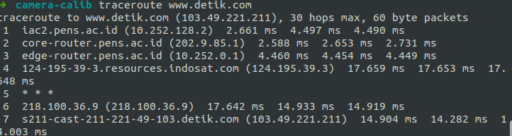
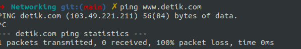

# Analsis Traceroute dan Ping

## Tentang Projek

Repository untuk menyimpan semua tugas pada mata kuliah Konsep Jaringan yang diampu oleh Dr. Ferry Astika Saputra ST, M.Sc ([@ferryastika](https://github.com/ferryastika)).

---

## Traceroute ke www. detik.com

### Analisis :

**1. Hop Pertama (10.252.128.2):**

    IP Address: Hop pertama adalah iac2.pens.ac.id dengan alamat IP 10.252.128.2.

    RTT: Waktu yang dibutuhkan untuk mencapai hop ini berkisar antara 2.661 ms hingga 4.497 ms.

**2. Hop Kedua (202.9.85.1):**

    IP Address: Hop kedua adalah core-router.pens.ac.id dengan alamat IP 202.9.85.1.
    RTT: Waktu yang dibutuhkan untuk mencapai hop ini berkisar antara 2.588 ms hingga 2.731 ms.

**3. Hop Ketiga (10.252.0.1):**

    IP Address: Hop ketiga adalah edge-router.pens.ac.id dengan alamat IP 10.252.0.1.

    RTT: Waktu yang dibutuhkan untuk mencapai hop ini berkisar antara 4.449 ms hingga 4.460 ms.

**4. Hop Keempat (124.195.39.3):**

    IP Address: Hop keempat adalah 124-195-39-3.resources.indosat.com dengan alamat IP 124.195.39.3.

    RTT: Waktu yang dibutuhkan untuk mencapai hop ini berkisar antara 17.648 ms hingga 17.659 ms.

**5. Hop Kelima: Sepertinya tidak ada respons dari hop ini (\* \* \*).**

Ini bisa berarti hop ini tidak merespons permintaan traceroute.

**6. Hop Keenam (218.100.36.9):**

    IP Address: Hop keenam adalah 218.100.36.9.

    RTT: Waktu yang dibutuhkan untuk mencapai hop ini berkisar antara 14.919 ms hingga 17.642 ms.

**7. Hop Ketujuh (103.49.221.211):**

    IP Address: Hop ketujuh adalah s211-cast-211-221-49-103.detik.com dengan alamat IP 103.49.221.211.

    RTT: Waktu yang dibutuhkan untuk mencapai tujuan akhir (detik.com) berkisar antara 14.003 ms hingga 14.904 ms.

## Ping ke www.detik.com

